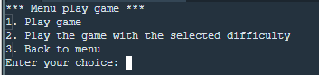
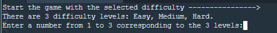
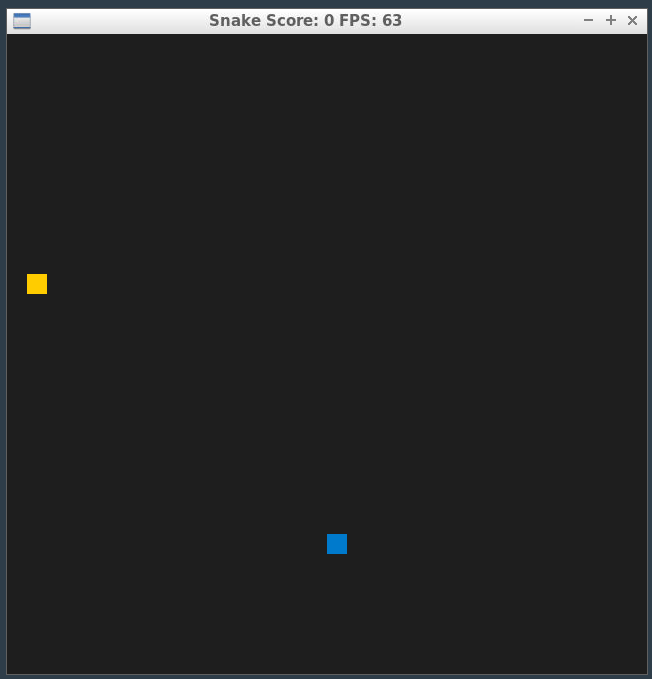
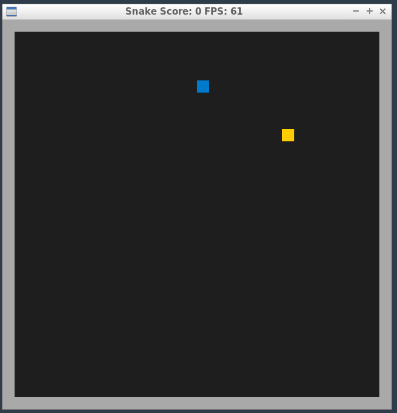
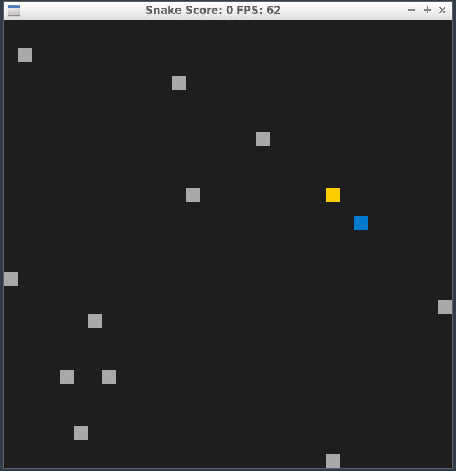
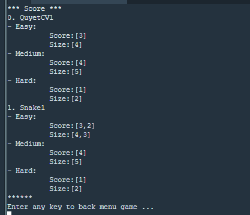
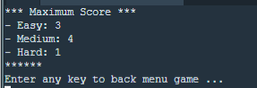

# CPPND: Capstone Snake Game Example

This is a starter repo for the Capstone project in the [Udacity C++ Nanodegree Program](https://www.udacity.com/course/c-plus-plus-nanodegree--nd213). The code for this repo was inspired by [this](https://codereview.stackexchange.com/questions/212296/snake-game-in-c-with-sdl) excellent StackOverflow post and set of responses.

The Capstone Project gives you a chance to integrate what you've learned throughout this program. This project will become an important part of your portfolio to share with current and future colleagues and employers.

In this project, you can build your own C++ application or extend this Snake game, following the principles you have learned throughout this Nanodegree Program. This project will demonstrate that you can independently create applications using a wide range of C++ features.

## Dependencies for Running Locally
* cmake >= 3.7
  * All OSes: [click here for installation instructions](https://cmake.org/install/)
* make >= 4.1 (Linux, Mac), 3.81 (Windows)
  * Linux: make is installed by default on most Linux distros
  * Mac: [install Xcode command line tools to get make](https://developer.apple.com/xcode/features/)
  * Windows: [Click here for installation instructions](http://gnuwin32.sourceforge.net/packages/make.htm)
* SDL2 >= 2.0
  * All installation instructions can be found [here](https://wiki.libsdl.org/Installation)
  >Note that for Linux, an `apt` or `apt-get` installation is preferred to building from source. 
* gcc/g++ >= 5.4
  * Linux: gcc / g++ is installed by default on most Linux distros
  * Mac: same deal as make - [install Xcode command line tools](https://developer.apple.com/xcode/features/)
  * Windows: recommend using [MinGW](http://www.mingw.org/)
## Additional Libraries
This project requires the following libraries:
- **nlohmann/json** >= 3.11.2
### Installation Instructions
  1. Clone the repo: [nlohmann/json](https://github.com/nlohmann/json)
  2. Make a build directory in the top level directory: `mkdir build && cd build`
  3. Compile: `cmake .. && make install`
## Basic Build Instructions
1. Clone this repo.
2. Make a build directory in the top level directory: `mkdir build && cd build`
3. Compile: `cmake .. && make`
4. Run it: `./SnakeGame`.

## New Features Added
- **Obstacles**: Added walls and optionally random obstacles to the game levels.
  - **Expected Behavior**: Walls surround the game board. In level 3, random obstacles are added, which the snake must avoid.
  - **Code Addressed**: Implemented in `game.cpp` (lines 234-272)
- **Multi-threading**: Implemented a thread to handle obstacle movement and collision detection.
  - **Expected Behavior**: Obstacles move periodically, and collision detection runs concurrently with the main game loop.
  - **Code Addressed**: Implemented in `game.cpp` (lines 119-122, 252-301).

## Rubric Points Addressed
### Loops, Functions, I/O
- **Control Structures**: Demonstrated through various loops (`for`, `while`) and conditionals (`if`) in `game.cpp, menu_choices.cpp`.
- **File I/O**: Reading from and writing to JSON files implemented in `manager_db.cpp`.
- **User Input**: Accepting player name input for score saving in `main.cpp`. Acceting the menu choice for select to play or view score in `menu_choices.cpp`.

### Object-Oriented Programming
- **Classes and Access Specifiers**: Used in `game.h`, `snake.h`, `renderer.h`,`controller.h`, `manager_db.h` and `menu_choices.h`.
- **Member Initialization Lists**: Utilized in constructors of `game.cpp`, `menu_choices.cpp` and `snake.cpp`.
- **Inheritance and Polymorphism**: Inheritance used in various classes (`Snake`, `Renderer`, `ManagerDBJson`).

### Memory Management
- **References and RAII**: Demonstrated through `std::mutex` and `std::lock_guard` in `game.cpp`.
- **Destructors**: Used in `game.cpp` to manage resources.

### Concurrency
- **Multi-threading**: Implemented with `std::thread` for obstacle movement in `game.cpp`.
- **Mutex and Condition Variable**: Used to synchronize access to shared data in `game.cpp`.

## Detail Game
* Menu game 
Display the choices for user interaction  

* Play with difficulty  
  This feature allows users to select the difficulty level when playing the game    
  * Select 1: Quick game start with easy level
  * Select 2: Start game with difficulty level   
    * Number 1: Start game with easy level.  
    
    * Number 2: Start game with medium level. The medium level will have 4 additional walls around. The game will end when the snake hits a wall.  
    
    * Number 3: Start game with hard level. In hard mode, obstacles will appear randomly every 5 seconds. The game ends if the snake collides with an obstacle. 
    

3. View all the scores  
  

4. View max score  
  

## CC Attribution-ShareAlike 4.0 International

Shield: [![CC BY-SA 4.0][cc-by-sa-shield]][cc-by-sa]

This work is licensed under a
[Creative Commons Attribution-ShareAlike 4.0 International License][cc-by-sa].

[![CC BY-SA 4.0][cc-by-sa-image]][cc-by-sa]

[cc-by-sa]: http://creativecommons.org/licenses/by-sa/4.0/
[cc-by-sa-image]: https://licensebuttons.net/l/by-sa/4.0/88x31.png
[cc-by-sa-shield]: https://img.shields.io/badge/License-CC%20BY--SA%204.0-lightgrey.svg
